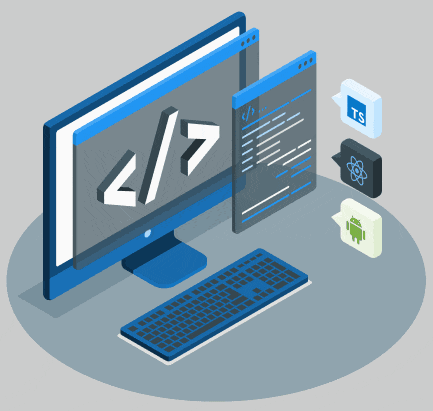

## Hey 👋, I'm Azzam El Haffar!

 

I'm a **Computer Engineer** with an M.S. in Computer and Communication Engineering, working across **software development, artificial intelligence, and computer vision**. My background spans building practical, real-world systems and doing academic research in deep learning — I like being equally comfortable shipping a working application and writing up a rigorous experimental study.

### 🧐 About Me

- 🎓 &nbsp; M.S. in Computer and Communication Engineering, and a B.S. in Computer Engineering, from LIU University
- 💻 &nbsp; Solid foundation in software engineering, algorithms, and problem-solving, across desktop, web, and mobile
- 🧠 &nbsp; Research background in **deep learning and computer vision**, with a focus on **Genetic Algorithm-based optimization**
- 📱 &nbsp; Experience building and maintaining cross-platform mobile apps with **Flutter and Dart**
- ⚙️ &nbsp; Experience with **C++** systems-level work — memory management, linking, debugging, and third-party library integration
- 🌐 &nbsp; Comfortable across the full stack, from **PHP/MySQL** backends to **React/Node.js** based web apps
- 📄 &nbsp; Published and peer-reviewed research author, with work appearing in **IEEE Xplore** and an **AI/ML journal**
- 🗣️ &nbsp; Fluent in Arabic, English, and French

 

### 💼 Experience

- **Intelligile** (2025) — Built foundational C++ skills through debugging, linking, and third-party library integration, along with systems-level troubleshooting (memory management, dependencies, OS interactions).
- **NevyBits** (2024) — Developed and maintained cross-platform mobile applications with Flutter/Dart, building responsive UI components and animations, and participated in regular code reviews.

 

### 🔨 Languages and Tools

 
 

### 🎓 Research & Publications

My graduate research focuses on **deep learning**, applying architectures like **YOLOv12s, ResUNet++, and ResNet50**, enhanced with **Genetic Algorithm-based hyperparameter optimization**, to build and evaluate high-performing computer vision models.

- 📖 &nbsp; *High-Performance Brain Tumor Detection in MRI Using YOLOv12s: A Comparative Study* — Proceedings of ICIICE 2026, **IEEE Xplore**
- 📖 &nbsp; *Dual-Task ResUNet++ with Genetic Algorithm Hyperparameter Optimization for Brain Tumor Segmentation and Classification* — accepted, **Applied Artificial Intelligence and Machine Learning (AAIML) Journal**

 

### 🛠️ Projects

- 🧠 &nbsp; **Master's Thesis — Brain Tumor Detection and Classification** — Deep learning frameworks combining detection, segmentation, and classification, evaluated on public brain MRI datasets against state-of-the-art models.
- 📝 &nbsp; **NotePilot** — A Flutter-based desktop notes app that integrates AI capabilities via the OpenAI API, for creating, managing, and organizing notes and prompts.
- 💊 &nbsp; **Multi-Pharmacy Management System** — A client–server project with a PHP backend and an HTML/CSS/JavaScript frontend built with Bootstrap, for managing multiple pharmacy branches.
- 🩸 &nbsp; **Blood Bank Management System** — A Java Swing desktop application for managing donors, blood inventory, and requests.

 

📫 &nbsp; Reach out via [GitHub](https://github.com/AzzamElHaffar) or [LinkedIn](https://www.linkedin.com/in/azzam-el-haffar) — always happy to talk software, systems design, or ML research.
